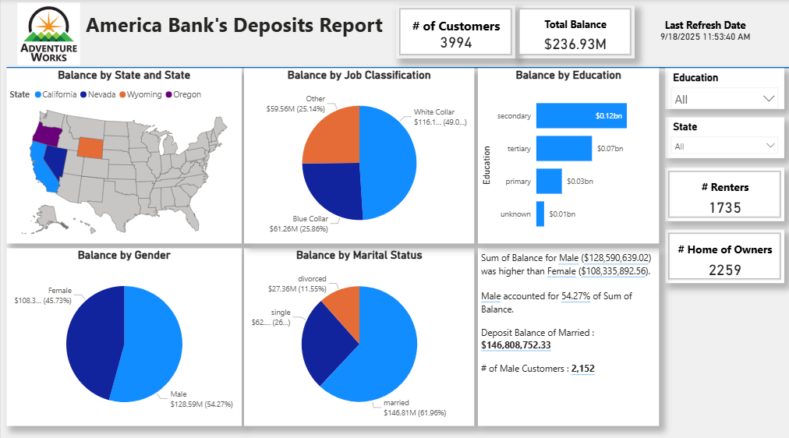

# Power BI Dashboard: America Bank's Deposits Report

This project is a **Power BI dashboard** analyzing bank deposits across different customer demographics.  
I created this project while learning Power BI through a **Udemy course**.  
The course provided guidance and tutorials for building the base dashboard, but I added my own **custom visuals and chart variations** to improve the design and insights.

---

## 📝 Project Objectives
- Analyze deposit balances across **States, Gender, Education, Job Classification, and Marital Status**
- Provide KPIs such as **Total Customers, Total Balance, # of Renters, and # of Home Owners**
- Allow filtering by **Education** and **State**
- Highlight key differences in balances between customer segments

---

## ✨ Features
- Interactive **slicers** for filtering by Education and State  
- **Custom visuals** for demographics breakdown (bar charts, pie charts, card visuals)  
- **Geographic map** showing balances by U.S. States  
- **KPIs** cards to display key metrics at a glance  
- **Tooltips** for additional context on hover  
- **Drill-through/detail pages** to explore customer segment details  
- Clear and visually appealing layout for quick insights

---

## 📊 Dashboard Insights
The dashboard provides:
- **Geographic view**: Balances by U.S. States (California, Nevada, Wyoming, Oregon)
- **Demographics**:
  - Balance by Gender → Male (54.27%) vs Female (45.73%)
  - Balance by Education → Secondary, Tertiary, Primary, Unknown
  - Balance by Job Classification → White Collar, Blue Collar, Other
  - Balance by Marital Status → Married, Single, Divorced
- **KPIs**:
  - Total Balance: **$236.93M**
  - Customers: **3,994**
  - Renters: **1,735**
  - Home Owners: **2,259**

---

## 📂 Files
- `America_Bank_Dashboard.pbix` → Power BI dashboard file
- `dashboard.png` → Screenshot preview

---

## 📷 Preview

---

## ⚙️ Tools Used
- Microsoft Power BI Desktop
